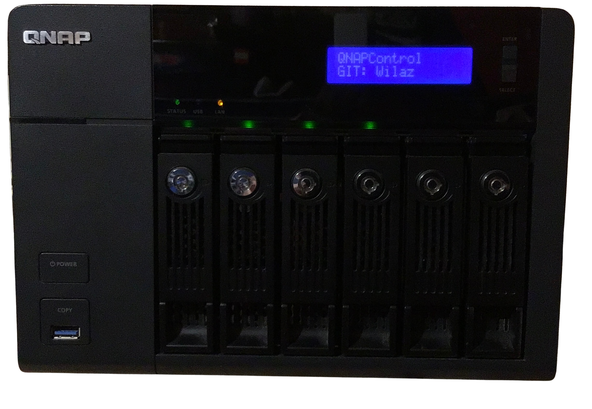

# QNAPControl

A Python module for interfacing with LCDs on QNAP NASes. Supports writing to LCDs as well as reading front panel keypresses.



## Install

```bash
pip install git+https://github.com/Wilaz/QNAPControl.git
```
